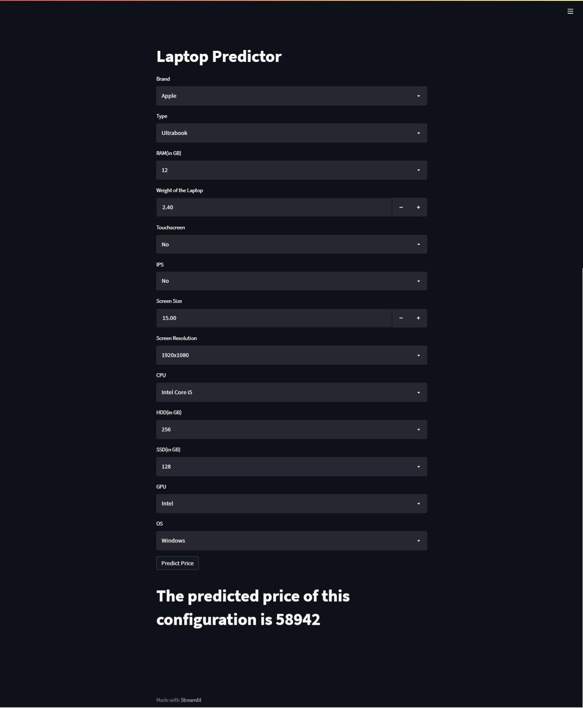

# Laptop Price Prediction Project

### App Screenshot



### Summary
Laptop Price Prediction Project, this project is developed to find out market value price of new laptops. To pridict the cost of the laptop we have used Random Forest Algorithm. And It provides 88% accuracy level. Main aim for developing this project is to enhance my knowledge and to get internship.


### Motivation

The main motivation to develop this project is to enhance my knowledge and to get internship in Data Science Position.


## Roadmap

- Taking Data

- Preprocessing Data

- Developing Price Predicting models

- Developing Website for taking input and showing predicted price

- Deploying the website in cloud


## Deployment

To deploy this project in local host follow following steps

```bash
  download the Zip File from my Github Profile
```
```bash
  Open any editor like VS Code or, pycharm
```
```bash
  Create new Project with virtual environment
```
```bash
  Copy downloaded files in your project
```
```bash
  Then install packages (in terminal type): pip install streamlit
```
```bash
   Install plotly packages (in terminal type): pip install plotly
```
```bash
   Install sklearn packages (in terminal type): pip install sklearn
```
```bash
  To run project (in terminal type) : streamlit run app.py 
```

## Dataset
Data set Link:  https://www.kaggle.com/datasets/ionaskel/laptop-prices


## Demo


## App Live Demo 
Heroku App link: 

## Authors

- [@dipeshadhikarioffical](https://www.github.com/dipeshadhikarioffical)


## 🛠 Skills Gained
Python, machine learning, Statistics, Data Analysis, Sklearn, Streamlit


## 🔗 Follow Me On

[](https://www.linkedin.com/in/dipeshadhikarioffical/)
[](https://facebook.com/dipeshadhikarioffical)


